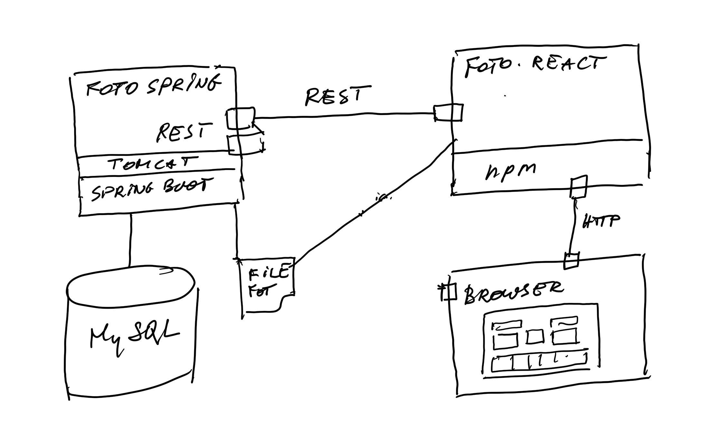
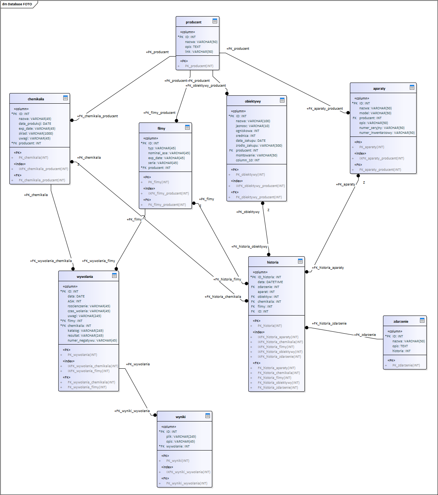

## FotoSpring

Rest services for managing photographic experiments with different films and developers.
### main technical  goal:
deliver REST services for learning React-Redux
### technical stack
backend: Java + SpringBoot + REST + MySQL + Hibernate
##Architecture

REST

https://www.tablesgenerator.com/markdown_tables#

| Id | metoda | adres             | parametry                              | opis                              |
|----|--------|-------------------|----------------------------------------|-----------------------------------|
| 1  | GET    | /foto/producenci  |      |                                 | Lista producentów filmów i chemii | 
| 2  | GET    | /foto/filmy       | Producent                              | Lista filmów wg producenta        |
| 3  | GET    | /foto/chemia      | Producent                              | Lista chemikaliów wg producenta   |
| 4  | POST   | /foto/wywolanie   | Film, chemia, czas, rozcieńczenie, ASA | Zapis wywolania filmu             |
| 5  | GET    | /foto/wywolanie   | Film, chemia, rozcieńczenie, ASA       | Czas wywołania                    |
| 6  | GET    | /foto/wywolanie   | Id                                     | Lista linków do zdjęc             |
| 7  | POST   | /foto/multi-upload| katalog, pliki jpg                     | Zapis plików zdjęc                |            
     |
				
				
Database

